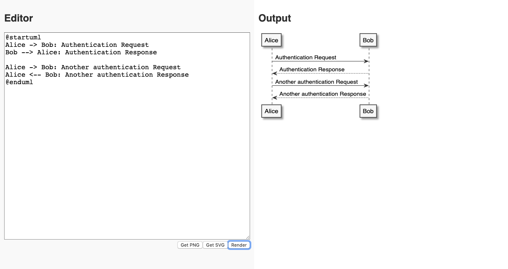

# PlantUML REPL

Browser-based REPL for creating UML diagrams with [PlantUML](https://plantuml.com/).

## Requirements

- Docker
- Docker Compose

## Getting Started

- Run `npm run serve`
- Go to `http://localhost:3000` in any web browser
